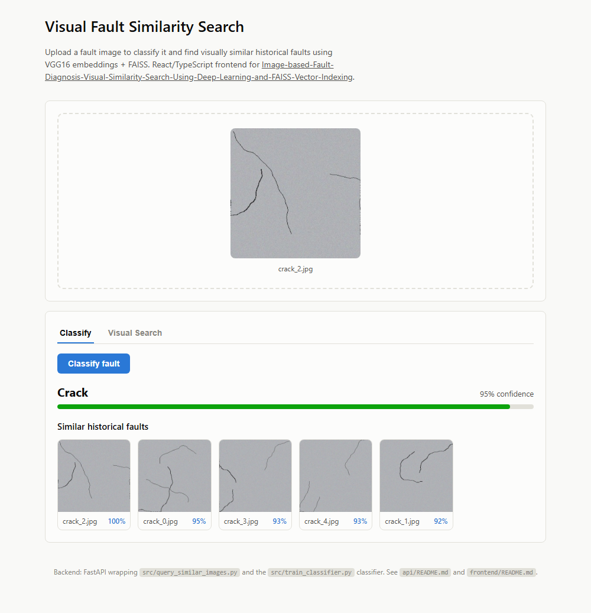
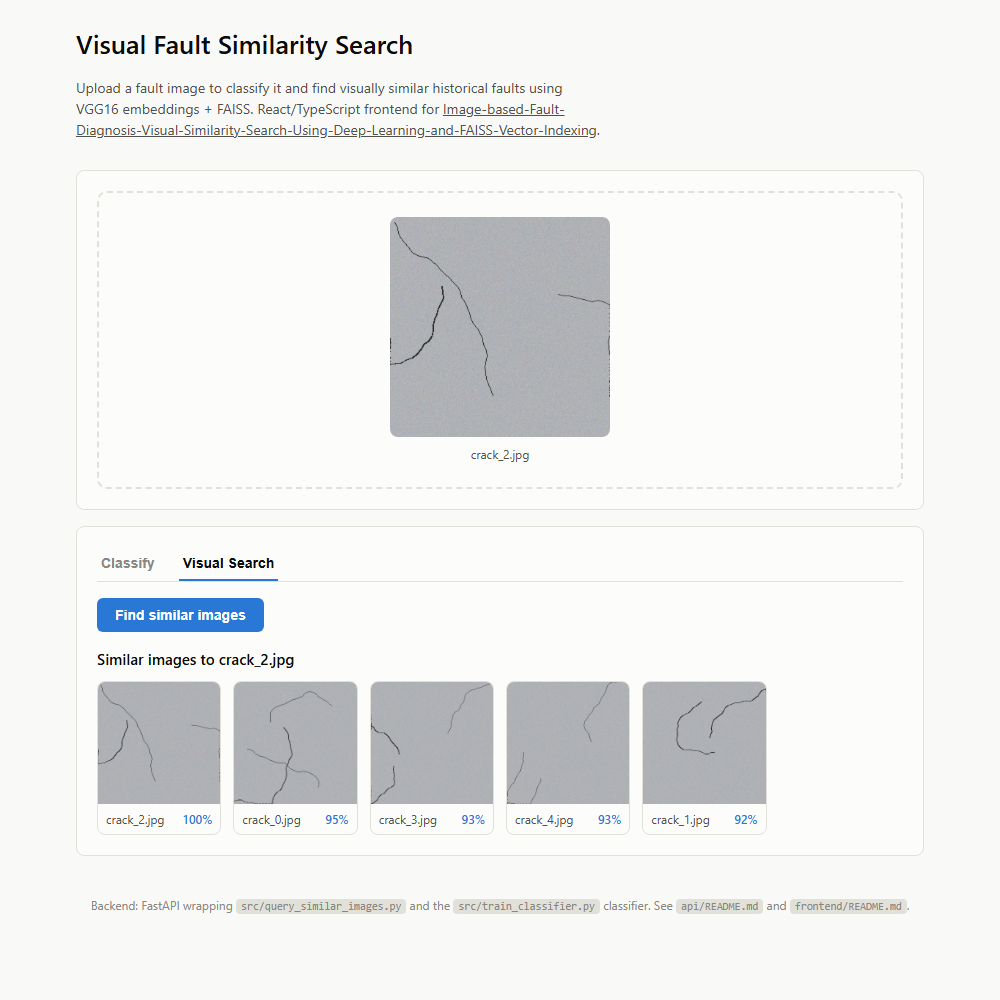

# Enterprise Image based Fault Diagnosis & Visual Similarity Search Using Deep Learning and FAISS Vector Indexing

## Project Summary

Manufacturing companies receive defective or faulty material images from customers. Internal engineers manually review returned images, compare them to historical fault libraries, and identify root causes.

This project automates fault identification and recommendation:

- Classifies material faults from customer images
- Retrieves visually similar past defect images using FAISS
- Serves both through a REST API and a React/TypeScript frontend, so engineers can use it interactively instead of only from the command line

Enabling faster diagnosis, consistent decisions, and knowledge reuse across engineering teams.

---

## Screenshots

The [React/TypeScript frontend](frontend/README.md)'s **Classify** tab —
predicted fault label with a confidence meter, plus visually similar
historical faults, from one uploaded image:



The **Visual Search** tab — pure image-similarity retrieval, no classifier
involved, with a similarity score per result:



---

## Why This Stack?

<ins>VGG16 for Feature Extraction</ins>

- Proven performance on general image tasks
- Pre-trained on ImageNet → generalizable features
- Lightweight vs. modern ViTs → Lower latency for enterprise use
- Replaceable later with EfficientNet, ConvNeXt-V2, or Vision Transformers

<ins>FAISS for Vector Search</ins>

- Blazing-fast similarity search on 100K+ images
- Designed by Meta AI for production vector systems
- Supports CPU & GPU indexing
- Perfect for enterprise applications where SPEED & SCALE matter.

<ins>TensorFlow</ins>

- Stable for enterprise MLOps
- Integrates with TF-Serving, Kubeflow, GCP/AWS ML stacks

---

## Use-Case Workflow

- Engineers upload labeled fault images
- VGG16 extracts embeddings → stored in FAISS index
- Train classifier on fault categories

New fault arrives (via the [React frontend](frontend/README.md) or the REST
API) → system returns:

- Predicted fault label
- Similar historical images

---

## Repo structure

```
.
├── api/                        # FastAPI backend (see api/README.md)
│   ├── main.py                  #   /api/health, /api/search, /api/classify
│   ├── models.py                #   loads + caches VGG16/FAISS/classifier once at startup
│   └── schemas.py               #   Pydantic response models
├── frontend/                    # React + TypeScript app (see frontend/README.md)
│   └── src/
├── app/
│   └── streamlit_visual_search.py   # original Streamlit visual-search UI (still works)
├── src/
│   ├── config.py
│   ├── extract_embeddings.py    # image_dir -> VGG16 embeddings.npy + image_names.npy
│   ├── build_faiss_index.py     # embeddings.npy -> index.faiss
│   ├── train_classifier.py      # embeddings.npy + labels.csv -> classifier.joblib
│   └── query_similar_images.py  # CLI: find similar images for a query image
├── generate_sample_dataset.py    # synthesizes a small demo dataset -- see Quickstart
├── data/                         # gitignored -- created by generate_sample_dataset.py or your own images
│   ├── raw/                     # fault images (yours, or the generated demo set)
│   ├── processed/               # labels.csv
│   └── faiss_index/             # embeddings.npy, index.faiss, classifier.joblib
├── notebooks/                    # exploratory notebooks
├── requirements.txt               # CPU-friendly by default
├── requirements-gpu.txt           # optional GPU acceleration (faiss-gpu, cuDNN)
└── LICENSE
```

### Project Structure Explained

| Folder | Contents |
|--------|----------|
| `api/` | FastAPI REST backend |
| `frontend/` | React + TypeScript UI |
| `data/` | raw images, labels, FAISS index files (gitignored — generated, not committed) |
| `notebooks/` | EDA, training, index building notebooks |
| `src/` | Python scripts for embeddings, FAISS, classifier |
| `app/` | Streamlit UI for engineers |
| `requirements.txt` | dependencies |

---

### Core Pipeline Code

This repository uses VGG16 to extract image embeddings and FAISS to
build/query the vector index. The actual implementation lives in
[`src/extract_embeddings.py`](src/extract_embeddings.py),
[`src/build_faiss_index.py`](src/build_faiss_index.py), and
[`src/query_similar_images.py`](src/query_similar_images.py); the
condensed version below shows the core idea in one place:

```python
import numpy as np
import faiss
from tensorflow.keras.applications.vgg16 import VGG16, preprocess_input
from tensorflow.keras.preprocessing import image
import os

# 1. Load VGG16 model
model = VGG16(weights='imagenet', include_top=False, pooling='avg')

# 2. Preprocess image
def load_and_preprocess_image(img_path):
    img = image.load_img(img_path, target_size=(224, 224))
    img_array = image.img_to_array(img)
    img_array = np.expand_dims(img_array, axis=0)
    img_array = preprocess_input(img_array)
    return img_array

# 3. Extract features
def extract_features(img_path):
    features = model.predict(load_and_preprocess_image(img_path))
    return features.flatten()

# 4. Load dataset
image_dir = 'data/raw'
image_files = [os.path.join(image_dir, f) for f in os.listdir(image_dir)
               if f.lower().endswith(('.jpg', '.png', '.jpeg'))]

image_features = []
image_names = []

for img_file in image_files:
    image_features.append(extract_features(img_file))
    image_names.append(os.path.basename(img_file))

image_features = np.array(image_features).astype("float32")  # FAISS requires float32

# 5. Create FAISS Index (Cosine similarity ≈ L2 normalized index)
dim = image_features.shape[1]
faiss.normalize_L2(image_features)  # Normalize vectors first

index = faiss.IndexFlatIP(dim)  # Inner product = cosine when normalized
index.add(image_features)       # Add all vectors to FAISS

print("FAISS index built with", index.ntotal, "images.")

# 6. Search function using FAISS
def find_similar_images(query_image_path, top_n=5):
    query_vec = extract_features(query_image_path).astype("float32").reshape(1, -1)
    faiss.normalize_L2(query_vec)

    distances, indices = index.search(query_vec, top_n+1)  # Query FAISS
    results = []

    for idx, score in zip(indices[0], distances[0]):
        if image_names[idx] != os.path.basename(query_image_path):  # Skip same image
            results.append((image_names[idx], float(score)))
        if len(results) >= top_n:
            break

    return results

# Example usage
# similar = find_similar_images("data/raw/query.jpg", top_n=3)
# for img, score in similar:
#     print(img, score)
```

---

## Quickstart

### 1. Install Python dependencies

```bash
python -m venv .venv
source .venv/bin/activate   # Windows: .venv\Scripts\activate
pip install -r requirements.txt
```

This installs a CPU build of TensorFlow and FAISS, so the whole pipeline
runs without a GPU. For GPU acceleration, see [GPU setup](#gpu-setup) below.

### 2. Get a dataset

Either generate a small synthetic demo dataset (10 images, two fault
classes — enough to run everything below immediately):

```bash
python generate_sample_dataset.py
```

...or place your own labeled fault images in `data/raw/` and a matching
`data/processed/labels.csv` (columns: `filename,label`).

### 3. Build the embeddings, FAISS index, and classifier

Run these **in order** — each one depends on the previous step's output:

```bash
python -m src.extract_embeddings   # data/raw/*.jpg -> embeddings.npy, image_names.npy
python -m src.build_faiss_index    # embeddings.npy -> index.faiss
python -m src.train_classifier     # embeddings.npy + labels.csv -> classifier.joblib
```

(Run as `python -m src.<name>`, not `python src/<name>.py` — the scripts
import sibling modules as `src.config` etc., which only resolves correctly
when Python is invoked as a module from the repo root.)

### 4. Run it

**Option A — REST API + React/TypeScript frontend (recommended):**

```bash
# Terminal 1
uvicorn api.main:app --reload --port 8000

# Terminal 2
cd frontend
npm install
npm run dev
```

Open the URL Vite prints (typically http://localhost:5173). Upload a fault
image from `data/raw/` and either run **Classify** (predicted label +
similar faults) or **Visual Search** (similar faults only). See
[`api/README.md`](api/README.md) and [`frontend/README.md`](frontend/README.md)
for endpoint details and configuration.

**Option B — CLI:**

```bash
python -m src.query_similar_images --query data/raw/crack_0.jpg --top_k 5
```

**Option C — original Streamlit visual-search app:**

```bash
streamlit run app/streamlit_visual_search.py
```

### GPU setup

```bash
sudo apt install nvidia-driver-530 nvidia-cuda-toolkit
pip install -r requirements.txt
pip uninstall faiss-cpu
pip install -r requirements-gpu.txt
```

`faiss-cpu` and `faiss-gpu` both install the same `faiss` module, so install
the GPU one *instead of*, not alongside, the CPU one.

---

## Enterprise Expansion Ideas

| Feature | Benefit |
|---------|---------|
| Add authentication to the REST API | internal engineering portal with access control |
| Add metadata store (PostgreSQL / Milvus Hybrid) | store engineer notes + corrective actions |
| Use Vector-DB cloud providers | Pinecone, Weaviate, Milvus |
| Integrate LLMs | Generate recommended corrective actions + knowledge mining |
| Vision Transformers | Improve accuracy vs VGG16 |
| MLflow / Kubeflow | Versioning & deployment automation |

---

## Future Work with LLMs

| LLM Enhancement | Description |
|-----------------|-------------|
| Fault Reasoning Agent | Explain root cause using retrieved history |
| Multi-modal RAG | Combine image embeddings + document embeddings |
| Chatbot for Engineers | Ask natural-language questions ("similar crack patterns in 2023?") |

---

Thank you for reading

---

### **AUTHOR'S BACKGROUND**

### Author's Name:  Emmanuel Oyekanlu
```
Skillset:   I have experience spanning several years in data science, software and AI solution design and deployments, data engineering,
high performance computing (GPU, CUDA), machine learning, MLOps, NLP, Agentic-AI and LLM applications, developing scalable enterprise data pipelines,
enterprise solution architecture, architecting enterprise systems data and AI applications, as well as deploying scalable solutions (apps) on-prem and in the cloud.

I can be reached through: manuelbomi@yahoo.com

Website:  http://emmanueloyekanlu.com/
Publications:  https://scholar.google.com/citations?user=S-jTMfkAAAAJ&hl=en
LinkedIn:  https://www.linkedin.com/in/emmanuel-oyekanlu-6ba98616
Github:  https://github.com/manuelbomi

```
[](https://skillicons.dev)
